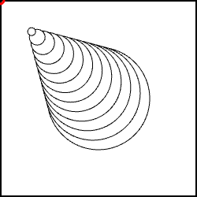
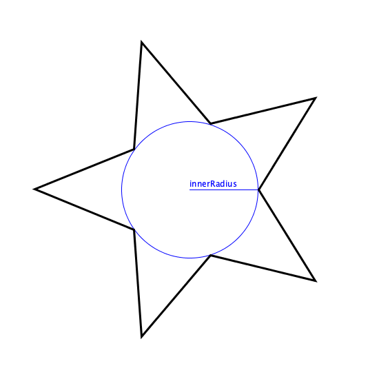
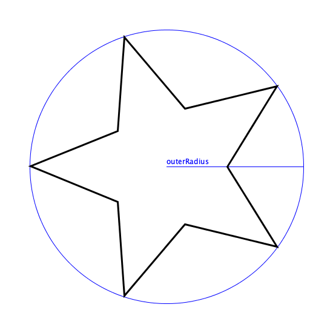
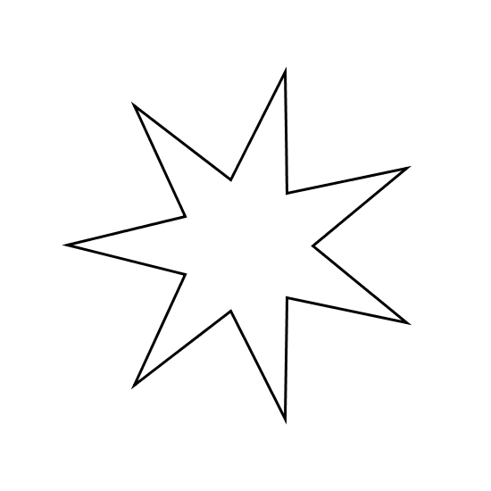

# Tarea. Vectores y trigonometría.

_Instrucciones_:

Resuelve las siguientes dinámicas usando vectores. Sube el resultado como un link a tu sandbox, por cada pregunta.

**Vectores**

1. Construye un sketch que tenga el siguiente comportamiento:

   1. Una serie de círculos de grandes a pequeños, que se aproximan al mouse.
   2. Los más grandes lo siguen de manera menor que los pequeños.
   3. Debes usar elementos de la clase `p5.Vector`.
   4. _Hint: Usa la operación_ `.mult()` _con varios escalares para cada círculo._
   5. A continuación se pone un ejemplo de cómo se debería de ver. El mouse está indicado con un círculo rojo.

   

**Trigonometría**

1. Crea la función `star(innerRadius, outerRadius, numPeaks)`, que dibuje una estrella. Los argumentos de la función son:

- `innerRadius`: Es un número que indica el radio interno de la estrella.
  
- `outerRadius`: Es un número que indica el radio externo de la estrella.
  
- `numPeaks`: Es el número de picos que va a tener la estrella.
  

_Hint: Divide el circulo en dos veces el número de picos de la estrella._
